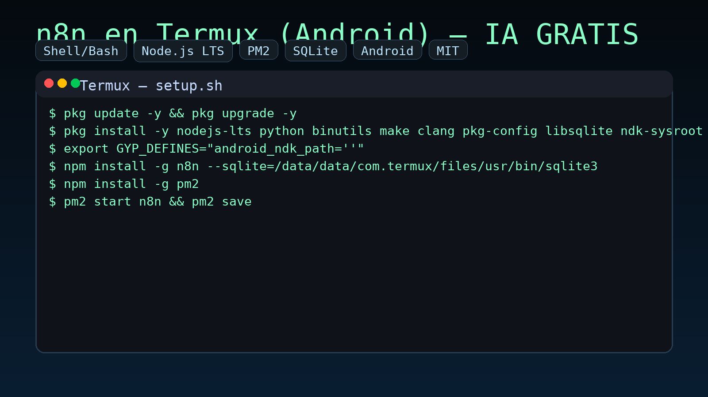
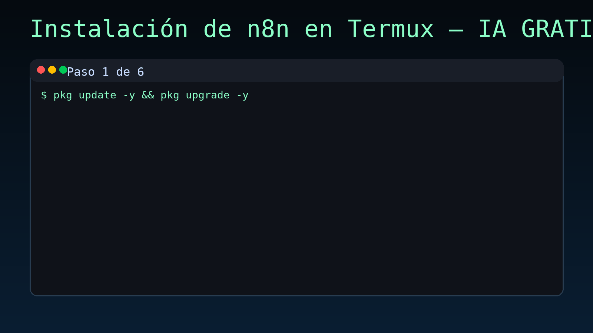
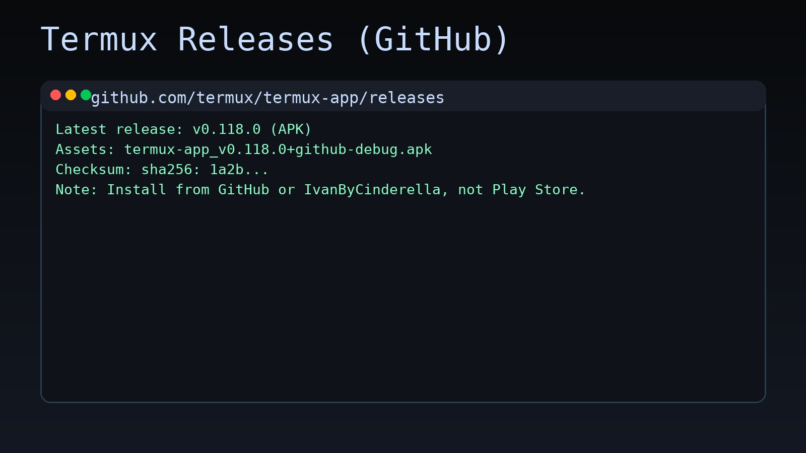
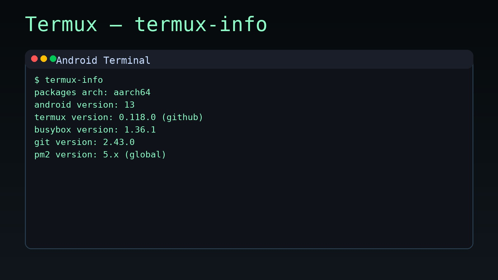
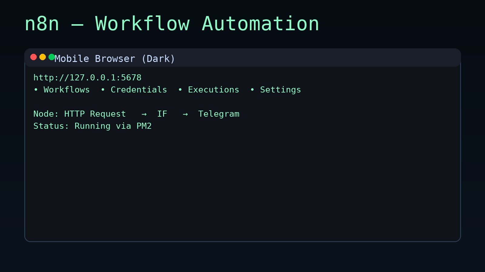

# n8n en Termux (Android) con IA — GRATIS, sin VPS, sin membresías
youtube/ https://youtube.com/shorts/tXAiWUwH88A?si=xkMO0f-VUkp9jR1Q

<p align="center">
  
</p>

<p align="center">
  
  
  
  
  
  
</p>


Automatiza con **n8n** directamente en tu **Android** usando **Termux** y **PM2**. 
Corre *local*, **gratis**, y evita pagar VPS o membresías de plataformas.

> ⚡️ Nota: Este repo acompaña un video corto de YouTube https://www.youtube.com/watch?v=DYtlUBZ3Od4. Según el autor, es la **primera** instalación pública de n8n en Android vía Termux.

## 🚀 Qué obtienes
- **Scripts reproducibles** para instalación y arranque con PM2
- Guión del video + subtítulos `.srt`
- Instrucciones de seguridad y persistencia
- Archivo `.gitignore` y licencia MIT

---

## 📋 Requisitos
- Android 8+ (recomendado 10+)
- [Termux](https://termux.dev)
> ⚠️ **Importante**: Instala Termux **únicamente** desde su [repositorio oficial en GitHub](https://github.com/termux/termux-app/releases) o desde los **Termux Packages** de [Ivan3ByCinderella](https://github.com/ivam3/termux-packages).  
> No uses versiones de Google Play, ya que están desactualizadas y pueden dar errores.
 (desde F-Droid o su repo oficial)
- Al menos **3 GB** de espacio libre
- Red local para acceder a n8n desde otro dispositivo (opcional)

---

## 🧰 Instalación rápida (copiar/pegar en Termux)

### 1) Clonar y entrar al proyecto (opcional)
```bash
pkg update -y && pkg upgrade -y
pkg install -y git
git clone https://github.com/kuromi04/n8n-termux-android-ia.git
cd n8n-termux-android-ia
```

### 2) Ejecutar instalador
```bash
chmod +x scripts/install_n8n_termux.sh
./scripts/install_n8n_termux.sh
```

> El script aplica las mismas órdenes que en el video, incluyendo la solución NDK y SQLite.

### 3) Iniciar n8n con PM2
```bash
chmod +x scripts/start_n8n_pm2.sh
./scripts/start_n8n_pm2.sh
```

### 4) Autoinicio al abrir Termux
El instalador ya agrega una línea a `~/.bashrc` para **resucitar** procesos PM2. Si quieres revisarlo:
```bash
tail -n 5 ~/.bashrc
```

### 5) Acceder desde el navegador
Busca tu IP local y abre `http://IP:5678` en el navegador (del móvil u otro dispositivo en la misma red):
```bash
ifconfig
```

---

## 🛡️ Seguridad mínima recomendada
- Configura **credenciales** vía variables de entorno (no subas `.env` con datos reales).
- Si expones el puerto 5678 fuera de tu red local, usa **proxy** con autenticación (por ejemplo, Caddy/Traefik/Nginx en el móvil o en el router).
- Considera **túneles temporales** (ngrok/cloudflared) para pruebas, no para producción.

---

## 🔧 Variables de entorno útiles (opcional)
Crea `~/.n8n/.env` (y carga con `export $(grep -v '^#' ~/.n8n/.env | xargs)` antes de iniciar):
```ini
# Puerto donde escuchará n8n
N8N_PORT=5678

# Usuario/contraseña inicial (solo si usas basic auth en un reverse proxy)
BASIC_AUTH_USER=admin
BASIC_AUTH_PASSWORD=cambia_esto

# Directorio de datos
N8N_USER_FOLDER=$HOME/.n8n

# Producción / desarrollo
NODE_ENV=production
```

---

## 🧪 Verificación rápida
```bash
pm2 list
pm2 logs n8n --lines 50
curl -I http://127.0.0.1:5678
```

---

## 🧯 Solución de problemas
- **Error de compilación**: Repite `pkg install -y ndk-sysroot` y asegúrate de tener `clang`, `make` y `python` instalados.
- **SQLite no encontrado**: Verifica la ruta `--sqlite=/data/data/com.termux/files/usr/bin/sqlite3`.
- **PM2 no resucita**: Asegúrate que `~/.bashrc` contenga `pm2 resurrect` (sin comillas) y que ejecutaste `pm2 save`.
- **No abre en el navegador**: Comprueba IP con `ifconfig`, firewall del router y que el puerto `5678` esté accesible en LAN.

---

## 🧾 Créditos
- Autor: @tiendastelegram
- Inspirado por la comunidad n8n y Termux
- Telegram: https://t.me/tiendastelegram

## 📄 Licencia
[MIT](LICENSE)


---

## 💾 Copias de seguridad

Los datos de n8n viven en `$HOME/.n8n`. Usa los scripts incluidos:

**Crear backup (archivo `.tar.gz` con timestamp en `~/backups/`):**
```bash
./scripts/backup_n8n.sh
```

**Restaurar desde un backup:**
```bash
./scripts/restore_n8n.sh ~/backups/n8n-backup-YYYYmmdd-HHMMSS.tar.gz
```

> Consejos PM2:
```bash
pm2 list
pm2 logs n8n --lines 50
pm2 save && pm2 resurrect
```

---

## 📲 Instalación de Termux (paso a paso con capturas)

> ⚠️ **Importante**: Siempre instala Termux desde su [repositorio oficial en GitHub](https://github.com/termux/termux-app/releases) o desde los **Termux Packages** de [IvanByCinderella](https://github.com/IvanByCinderella/termux-packages).  
> No uses la versión de Google Play: está desactualizada y puede dar problemas con n8n.

### **Opción 1 – GitHub oficial de Termux**
1. Abre este enlace en tu navegador: [https://github.com/termux/termux-app/releases](https://github.com/termux/termux-app/releases)
2. Busca la última versión estable (`.apk`) y tócala para descargar.  
   *(Ejemplo de captura: `assets/termux-release-github.jpg`)*
3. Una vez descargado, abre el archivo APK e instala (activa "permitir orígenes desconocidos" si es necesario).

### **Opción 2 – Termux Packages de IvanByCinderella**
1. Abre: [https://github.com/IvanByCinderella/termux-packages](https://github.com/IvanByCinderella/termux-packages)
2. En la sección de releases, descarga el `.apk` más reciente.
3. Instálalo igual que en la opción 1.

### **Verificación**
- Abre Termux y escribe:
```bash
termux-info
```
- Debe mostrar la versión instalada y arquitectura.  
  *(Ejemplo de captura: `assets/termux-info.jpg`)*

Con Termux instalado correctamente, ya puedes seguir los pasos de instalación de este repositorio.

---

## 🖼️ Demo & Capturas

<p align="center">
  
</p>

**Termux — Releases (GitHub):**


**Termux — `termux-info`:**


**n8n corriendo en navegador (oscuro):**

---

## 🤖 Casos de uso con IA

Con n8n en tu Android puedes automatizar casi cualquier cosa, por ejemplo:

- **Integración con Telegram** 📩 — Envía mensajes automáticos o responde con IA a tus grupos y canales.
- **WhatsApp Bots** 💬 — Responde automáticamente usando ChatGPT o modelos locales.
- **Google Sheets** 📊 — Registra datos, genera reportes y envía notificaciones cuando cambian celdas.
- **APIs externas** 🌐 — Consume APIs de IA para análisis de texto, visión por computadora o generación de imágenes.
- **Notificaciones inteligentes** 🔔 — Alertas por correo, push o mensajería solo cuando ocurre algo importante.
- **Scraping y resumen** 📰 — Recopila info de webs y genera resúmenes con IA directamente desde tu móvil.

> Todo esto sin pagar VPS, sin depender de la nube y con el control total de tus datos.
